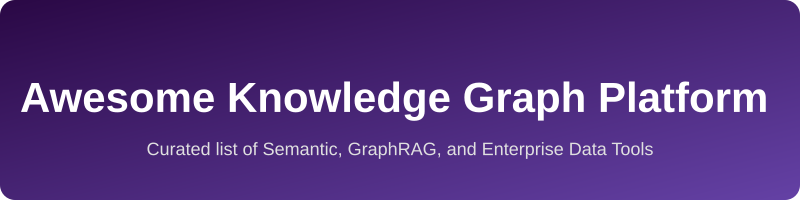

# Awesome-Knowledge-Graph-Platform
## Top Knowledge Graph Platforms Ecosystem
**Curated List of SaaS Products & Open-Source GitHub Projects**
*Focused on Enterprise Knowledge Graphs, Semantic Reasoning, RDF/SPARQL, Property Graphs, Ontology Management & GraphRAG*
**Last updated: July 2026**

This repository tracks notable **SaaS platforms** and **open-source projects** for **Knowledge Graph Platforms**. These tools enable the construction, storage, querying, reasoning, and visualization of knowledge graphs — connecting structured and unstructured data for AI, search, data integration, fraud detection, recommendations, and enterprise semantic layers using RDF, OWL, SPARQL, Cypher, Gremlin, and related standards.

**Examples** include Neo4j, Stardog, Ontotext GraphDB (now Graphwise), Amazon Neptune, Memgraph, data.world, AnzoGraph, PoolParty, Franz AllegroGraph, TopBraid EDG, Diffbot Knowledge Graph, Neo4j Aura, Cambridge Semantics Anzo, TopQuadrant EDG, Graphwise, Semantic Web Company, and Metaphacts (the category leaders).

**Open-source emphasis**: This section is heavily expanded with every major active project for self-hosting, custom ontology development, RDF triple stores, property graph engines, SPARQL endpoints, and GraphRAG pipelines — ideal for researchers, data engineers, AI teams, and organizations building transparent, standards-compliant knowledge solutions.

Contributions welcome! Open a PR to add/update entries. Keep descriptions factual and link to official sites.

## Table of Contents
- [SaaS/Hosted Platforms](#saas-hosted-platforms)
- [Open-Source GitHub Projects](#open-source-github-projects)
- [How to Contribute](#how-to-contribute)
- [Disclaimer](#disclaimer)

## SaaS/Hosted Platforms

| Platform | Valuation/Revenue | Pricing | Free Tier Limits | Description |
|---|---|---|---|---|
| **Microsoft Fabric IQ / Azure Cosmos DB** | $3.0 Trillion Valuation | Consumption-based | 1000 RU/s & 25GB | Graph capabilities and enterprise ontology management within Azure. |
| **[Amazon Neptune](https://aws.amazon.com/neptune/)** | $1.8 Trillion Valuation | Consumption-based | 750 hours/month of db.t3.medium (1 month) | Fully managed AWS graph database supporting property graphs (openCypher, Gremlin) and RDF/SPARQL. |
| **Oracle Spatial and Graph** | $300 Billion Valuation | Consumption-based | 2 Always Free autonomous databases | Graph Server and Spatial capabilities for Oracle Cloud. |
| **Palantir Foundry Ontology** | $40 Billion Valuation | Enterprise / Custom | No free tier | Enterprise knowledge graph platform for operations and analytics. |
| **[Neo4j / Neo4j Aura](https://neo4j.com/)** | $2.5 Billion Valuation | Pay-as-you-go & Enterprise | 1 DB, 200k nodes, 400k edges | Leading native property graph database with Cypher, vector search, and managed cloud. |
| **TigerGraph** | $1 Billion Valuation | Consumption-based | 50GB instance (TigerGraph Cloud) | Distributed analytics-focused graph platform. |
| **[Diffbot Knowledge Graph](https://www.diffbot.com/)** | ~$150 Million Valuation | Enterprise / Custom | 14-day free trial | AI-powered knowledge graph extracted from the public web via APIs. |
| **[data.world](https://data.world/)** | ~$100 Million Valuation | Enterprise / Custom | Community edition (public data) | Collaborative data catalog and knowledge graph platform for data discovery and governance. |
| **[Stardog](https://www.stardog.com/)** | ~$100 Million Valuation | Enterprise / Custom | Free tier with DB size limits | Enterprise knowledge graph platform with RDF/OWL reasoning, federation, and SPARQL/GraphQL. |
| **ArangoDB Oasis** | ~$50 Million Valuation | Consumption-based | 14-day free trial | Multi-model managed service supporting graphs, documents, and key-value. |
| **[Memgraph](https://memgraph.com/)** | ~$50 Million Valuation | Pay-as-you-go & Enterprise | Open source free, Cloud trial | High-performance in-memory graph database (Cypher) optimized for real-time analytics. |
| **[Ontotext GraphDB / Graphwise](https://graphwise.ai/)** | ~$30 Million Revenue | Enterprise / Custom | GraphDB Free with limits | High-performance RDF triple store with OWL reasoning, SPARQL, and GraphRAG capabilities. |
| **[PoolParty Semantic Suite](https://www.poolparty.biz/)** | ~$20 Million Revenue | Enterprise / Custom | No free tier | Semantic AI platform for taxonomy/ontology management and text mining. |
| **[Cambridge Semantics Anzo](https://cambridgesemantics.com/)** | ~$20 Million Revenue | Enterprise / Custom | AnzoGraph Free (up to 8GB RAM) | Semantic data fabric and MPP graph analytics engine supporting SPARQL and Cypher. |
| **[TopQuadrant TopBraid EDG](https://www.topquadrant.com/)** | ~$15 Million Revenue | Enterprise / Custom | No free tier | Enterprise data governance platform centered on knowledge graphs and ontologies. |
| **[Franz AllegroGraph](https://franz.com/agraph/)** | ~$10 Million Revenue | Enterprise / Custom | Free edition (5M triples) | Multi-model semantic graph database with advanced reasoning and Prolog. |
| **[Metaphacts](https://metaphacts.com/)** | ~$10 Million Revenue | Enterprise / Custom | 14-day free trial | Application platform for building semantic apps, search, and visualization on RDF. |
| **eccenca Corporate Memory** | ~$5 Million Revenue | Enterprise / Custom | No free tier | Enterprise knowledge graph and data integration platform. |

## Open-Source GitHub Projects

- **[Dgraph](https://github.com/dgraph-io/dgraph)** 
  Native distributed graph database with GraphQL-native interface, high performance, and horizontal scalability (now fully Apache 2.0).

- **[ArangoDB](https://github.com/arangodb/arangodb)** 
  Multi-model open-source database supporting graphs, documents, and key-value with a unified query language (AQL); Community Edition available.

- **[Memgraph](https://github.com/memgraph/memgraph)** 
  High-performance open-source (BSL) in-memory graph database with Cypher, built-in algorithms (MAGE), vector search, and strong real-time/GraphRAG focus.

- **[JanusGraph](https://github.com/JanusGraph/janusgraph)** 
  Highly scalable, distributed open-source property graph database (Apache TinkerPop/Gremlin) with pluggable storage (Cassandra, HBase, etc.) and indexing backends.

- **[TerminusDB](https://github.com/terminusdb/terminusdb)** 
  Open-source document + knowledge graph database with Git-like versioning (branch, diff, merge, time-travel), GraphQL, and WOQL (Datalog-style) query language.

- **[Apache Jena / Fuseki](https://github.com/apache/jena)** 
  Comprehensive open-source Java framework for Semantic Web and Linked Data applications, including TDB storage, SPARQL engine, and Fuseki SPARQL server.

- **[Oxigraph](https://github.com/oxigraph/oxigraph)** 
  Fast, standards-compliant RDF graph database and SPARQL toolkit written in Rust (RocksDB-backed), with Python and JavaScript bindings.

- **[ArcadeDB](https://github.com/ArcadeData/arcadedb)** 
  Fully open-source (Apache 2.0) multi-model database supporting graphs, documents, key-value, time-series, and vectors with SQL, Cypher, Gremlin, and GraphQL.

- **[Protégé](https://github.com/protegeproject/protege)** 
  The leading free, open-source ontology editor supporting OWL 2, with desktop and collaborative WebProtégé versions for ontology engineering.

- **[Blazegraph](https://github.com/blazegraph/database)** 
  High-performance open-source RDF/SPARQL and property graph database (powers Wikidata Query Service); note: development largely paused after AWS acquisition of the team.

- **[OpenLink Virtuoso (Open Source Edition)](https://github.com/openlink/virtuoso-opensource)** 
  High-performance multi-model RDBMS and RDF triple store with SPARQL, Linked Data deployment, and data integration capabilities.

- **[Eclipse RDF4J](https://github.com/eclipse-rdf4j/rdf4j)** 
  Scalable Java framework for RDF processing, storage, reasoning, and querying with a vendor-neutral Repository API and SPARQL support.

- **[QLever](https://github.com/ad-freiburg/qlever)** 
  Extremely fast SPARQL engine and RDF triplestore that scales to hundreds of billions (and beyond) of triples on a single commodity machine, with full-text and GeoSPARQL support.

### Additional Strong Open-Source Options
- **Apache AGE** — PostgreSQL extension adding openCypher graph capabilities.
- **FalkorDB** — Ultra-fast in-memory graph database optimized for GraphRAG and LLMs.
- **HugeGraph** — Apache open-source graph database focused on large-scale graph processing.
- **Cayley** — Open-source graph database inspired by Google’s Knowledge Graph (Go).
- **RDFLib** — Popular Python library for working with RDF and SPARQL.
- **NetworkX / igraph / graph-tool** — Python libraries for graph analysis and algorithms (in-memory).
- **Sparnatural** — Visual SPARQL query builder for exploring RDF knowledge graphs.
- **Ontop** — Platform for querying relational databases as virtual RDF knowledge graphs via SPARQL.
- **Comunica** — Modular JavaScript framework for querying knowledge graphs.
- Many community **GraphRAG**, ontology, SHACL validation, and Linked Data tooling projects.

**Frameworks for building custom systems**: Combine **Apache Jena/Fuseki** or **Oxigraph/QLever** (RDF/SPARQL), **JanusGraph** or **ArcadeDB/Memgraph** (property graphs), **Protégé** (ontology editing), **RDFLib**, and **InfluxDB/Grafana** or vector stores with **LangChain/LlamaIndex** + local LLMs for intelligent knowledge graph and GraphRAG platforms.

## How to Contribute
1. Fork the repo.
2. Add/edit entries in `README.md` (follow existing format).
3. Include: name, link, 1–2 sentence description, and whether it's SaaS or open-source.
4. Submit PR with a short explanation.

Star the repo if you find it useful!

## Disclaimer
- This is a **community-curated** list — not exhaustive and not an endorsement.
- Knowledge graph platforms involve complex data modeling, reasoning, and governance; evaluate security, scalability, licensing (especially BSL vs OSI-approved), and standards compliance carefully.
- Self-hosted open-source solutions require proper operational expertise, backups, and access controls for production use.

---
**Made for data engineers, knowledge engineers, AI researchers, ontology developers, and semantic technology practitioners.**  
Let's make knowledge graphs more open, interoperable, and powerful.

